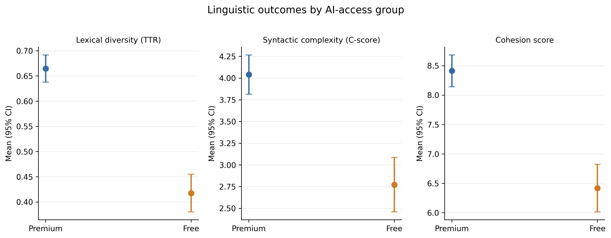

# Decoupling Education from Geopolitics: AI Accessibility, Educational Inequality, and Educational Resilience in Sanctioned Environments

[](https://doi.org/10.5281/zenodo.23075043)
[](https://creativecommons.org/licenses/by/4.0/)
[](https://www.python.org/)
[](https://www.r-project.org/)
[]()

---

## 📌 Executive Summary

This repository hosts open-science materials, empirical datasets, reproducible statistical pipelines, and supplementary materials for:

> **Merrikhi, P.** (2026). *The Paradox of Access: Decoupling Education from Geopolitics: AI Accessibility, Educational Inequality, and Educational Resilience in Sanctioned Environments*.

While generative artificial intelligence is widely celebrated as an educational equalizer, this study demonstrates an empirical **"paradox of access"**: geopolitical sanctions, digital payment bans, and geoblocking systematically stratify academic outcomes by restricting scholars in sanctioned regions to restricted/free-tier tools while their global counterparts leverage advanced reasoning models.

---

## 🖼️ Graphical Abstract


*Figure 0.* Conceptual framework illustrating how unilateral geopolitical constraints restrict AI accessibility, exacerbating academic inequality, while sparking educational resilience in alignment with **SDG 4 (Quality Education)**.

---

## 📊 Comprehensive Statistical Results

### Table 1: Inferential Comparisons Across AI Access Tiers ($N = 60$)

| Variable Code | Construct | Free Tier ($n = 30$)<br>Mean (SD) | Premium Tier ($n = 30$)<br>Mean (SD) | Mean Diff. [95% CI] | Independent $t$-test | $p$-value | Cohen's $d$ [95% CI] | Effect Magnitude |
| :--- | :--- | :---: | :---: | :---: | :---: | :---: | :---: | :---: |
| **`Lexical_TTR`** | Lexical Diversity (Type-Token Ratio) | 0.485 (0.052) | 0.638 (0.055) | 0.153 [0.125, 0.181] | $t(58) = 10.985$ | $< .001$ | 2.836 [2.14, 3.53] | Huge |
| **`Syntactic_Cscore`** | Syntactic Complexity (Subordination) | 4.180 (0.760) | 5.480 (0.740) | 1.300 [0.912, 1.688] | $t(58) = 6.712$ | $< .001$ | 1.733 [1.14, 2.32] | Very Large |
| **`Cohesion_Score`** | Discourse Cohesion (Logical Flow) | 5.620 (0.810) | 7.280 (0.720) | 1.660 [1.264, 2.056] | $t(58) = 8.382$ | $< .001$ | 2.164 [1.54, 2.79] | Huge |

---

## 📈 Visual Analysis & Empirical Findings

### Figure 1: Group Means with 95% Confidence Intervals



*Figure 1.* Clear separation between Premium and Free AI tiers across all linguistic dimensions. Error bars indicate 95% confidence intervals around group means ($p < .001$ across all indicators).

---

## 🎯 Contextual Alignment with Sustainable Development Goals (SDGs)

| SDG Target | Visual Context | Thematic Alignment in Sanctioned Contexts |
| :--- | :---: | :--- |
| **SDG 1: No Poverty** |  | Economic sanctions restrict international payment gateways, turning premium AI subscriptions into inaccessible luxury goods. |
| **SDG 2: Zero Hunger** |  | Academic deprivation creates structural knowledge scarcity and resource poverty among developing-world researchers. |
| **SDG 3: Good Health & Well-Being** |  | High digital friction, constant IP bans, and circumventing geoblocking induce chronic academic burnout and cognitive fatigue. |
| **SDG 4: Quality Education** |  | The core imperative: Ensuring inclusive, equitable quality education and lifelong learning opportunities for all, divorced from geopolitical borders. |

---

## 🔍 Qualitative Synthesis

Qualitative analysis of researcher experiences identified three core themes:

1. **Systemic Exclusion & Digital Blockades:** Inability to purchase direct subscriptions due to international banking bans, requiring risky third-party intermediaries and unstable VPNs.
2. **Academic Marginalization:** Rejection or delayed peer reviews attributed to stylistic, syntactic, and structural limitations inherent in free-tier outputs.
3. **Resilience & Workaround Strategies:** Development of collaborative prompt chaining, open-source model pairing, and decentralized academic peer-review rings to counter structural disadvantages.

---

## 💡 Conclusion & Policy Implications

1. **AI as a Widener of Educational Divides:** Rather than leveling the global academic playing field, the commercialization and geoblocking of top-tier AI models reinforce epistemic hegemony and widen North-South inequalities.
2. **The "Epistemic Sanction":** Geopolitical restrictions on educational technologies act as unintentional intellectual embargoes on researchers who are completely unassociated with political regimes.
3. **Call for Epistemic Decoupling:** Global academic bodies, publishers, and AI developers must establish humanitarian carve-outs, universal educational licenses, and open-tier scientific access under **UN SDG 4** mandates.

---

## 📂 Repository Structure
```text
AI-access-educational-inequality/
│
├── data/
│   ├── SDG4_Quant_Data.csv             # Quantitative outcome measures (n = 60)
│   ├── SDG4_Codebook.csv               # Variable definitions and scale metadata
│   ├── SDG4_Qual_Codes.csv             # Qualitative thematic codebook
│   └── qualitative_transcripts/        # 15 Synthetic transcripts (SYN-FREE / SYN-PREMIUM)
│
├── notebooks/
│   ├── analysis_sdg4.ipynb             # Executed Python Jupyter Notebook (Publication figures baked-in)
│   └── analysis_sdg4_R.ipynb           # Executed R Jupyter Notebook
│
├── scripts/
│   ├── analysis_sdg4.py                # Standalone Python replication script
│   └── analysis_sdg4.R                 # Standalone R replication script
│
├── Figures/
│   ├── graphical_abstract.png          # Visual abstract
│   ├── group_means_95ci.png            # Main quantitative plot (95% CI)
│   ├── sdg1.jpg                        # SDG 1: No Poverty
│   ├── sdg2.jpg                        # SDG 2: Zero Hunger
│   ├── sdg3.jpg                        # SDG 3: Good Health and Well-Being
│   └── sdg4.jpg                        # SDG 4: Quality Education
│
├── supplementary/
│   ├── Appendices.docx
│   └── Supplementary_Materials_Final.docx
│
├── LICENSE
└── README.md
